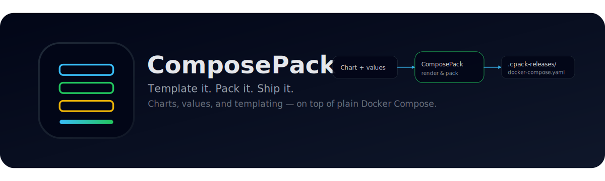
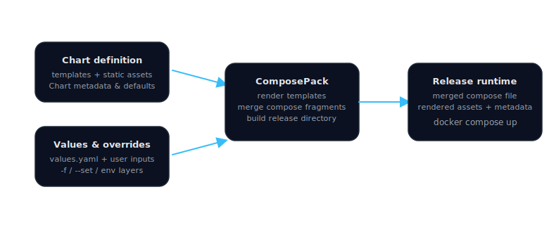

# **ComposePack**

**English** | [简体中文](README.zh.md)

> 🧩 **Pack your Compose, ship it anywhere.**  
> The power of Helm-style configuration for Docker Compose.

<p align="center">
  <!-- TODO: Replace with a real banner -->
  
</p>

<p align="center">
  <!-- Badges -->
  <a href="https://github.com/composepack/composepack/actions/workflows/ci.yml">
    
  </a>
  <a href="https://github.com/composepack/composepack/releases">
    
  </a>
  <a href="https://github.com/composepack/composepack/blob/main/LICENSE">
    
  </a>
  <a href="https://github.com/composepack/composepack/stargazers">
    
  </a>
</p>

Docker Compose is the standard for running multi-container applications, but it lacks **templating, dynamic configuration, and clean packaging.** Teams often struggle with giant YAML files, manual copy-pasting across environments, and complex `.env` file management.

**ComposePack fixes this.**

It brings a **modern templating engine**, **overridable config system**, and a **packaging workflow** to Docker Compose—while remaining 100% compatible with the standard Docker CLI.

### Why ComposePack?

* 📝 **Go-Style Templates:** Write dynamic Compose files with logic (`if`, `range`, etc.).
* ⚙️ **Structured Config:** Ship clean `values.yaml` defaults and allow user overrides.
* 📦 **Real Packaging:** Distribute your app as a versioned, installable `.cpack` chart.
* 🔐 **Reproducible Releases:** Render isolated, self-contained release directories.
* 🚀 **Native Runtime:** Under the hood, it's just `docker compose`.

## ⚖️ ComposePack vs. Docker Compose

| Feature                   |   Docker Compose   |   **ComposePack**    |
| :------------------------ | :----------------: | :------------------: |
| **Templating**            | ❌ (Variables only) |  **✅ (Full logic)**  |
| **Config Model**          |   ❌ (Flat .env)    | **✅ (Values.yaml)**  |
| **Packaging**             |         ❌          |    **✅ (Charts)**    |
| **Environment Isolation** |         ❌          | **✅ (Release Dirs)** |
| **Runtime Engine**        |         ✅          |        **✅**         |

---

## 📚 Table of Contents

* [⚡ Quick 60-Second Demo](#-quick-60-second-demo)
* [📦 Installation](#-installation)
* [🧠 How It Works (High-Level)](#-how-it-works-high-level)
* [🚀 How to Use](#-how-to-use)
  * [🛠️ For Chart Creators (Shippers)](#️-for-chart-creators-shippers)
  * [🧑‍💻 For Chart Users (Consumers)](#-for-chart-users-consumers)
* [🧩 Template Basics](#-template-basics)
* [📂 Chart Layout & File Types](#-chart-layout--file-types)
* [🏗️ Runtime Layout](#️-runtime-layout)
* [📏 Runtime Rules & Gotchas](#-runtime-rules--gotchas)
* [📝 FAQ](#-faq)
* [🤝 Contributing](#-contributing)

---

## ⚡ Quick 60-Second Demo

```bash
# 1. Scaffold a chart
composepack init charts/demo --name demo --version 0.1.0

# 2. Install it into a release with your own values
composepack install charts/demo --name myapp -f values-prod.yaml --auto-start

# 3. Watch logs
composepack logs myapp --follow
```

That’s it: templated config + reproducible runtime on top of plain Docker Compose.

---

## 📦 Installation

> ComposePack is a single binary with no external dependencies other than Docker & Docker Compose.

### Homebrew (macOS/Linux)

* If you’ve tapped `composepack/tap` already:

```bash
brew install composepack
```

* First time using the tap:

```bash
brew tap composepack/tap
brew install composepack
```

Note: once accepted to homebrew-core, `brew install composepack` will work without a tap on macOS and Linux.

### macOS / Linux (curl)

```bash
curl -fsSL https://raw.githubusercontent.com/composepack/composepack/main/scripts/install.sh | bash
```

* Installs to `/usr/local/bin/composepack` or falls back to `~/.local/bin/composepack`
* Override install directory with `COMPOSEPACK_INSTALL_DIR`

Uninstall:

```bash
./scripts/uninstall.sh
```

### Windows (PowerShell)

```powershell
./scripts/install.ps1 -Version v1.0.0 -InstallDir "$env:ProgramFiles\ComposePack"
```

Uninstall:

```powershell
./scripts/uninstall.ps1
```

### Build from source

```bash
git clone https://github.com/composepack/composepack.git
cd composepack
make build
```

`make generate` runs `go generate ./...` for Wire and other providers.

---

## 🧠 How It Works (High-Level)

<p align="center">
  
</p>

* You define a **chart** (templated Compose + assets).
* Users pass values (`values.yaml`, `--set`, env vars).
* ComposePack renders everything into a **self-contained release directory**.
* Docker Compose runs exclusively from that directory.

---

## 🚀 How to Use

ComposePack has two kinds of users:

* **Chart Creators (Shippers)** → build and package charts
* **Chart Users (Consumers)** → install and run charts

Below is the workflow for each.

---

### 🛠️ For Chart Creators (Shippers)

*(for teams packaging their applications)*

#### 1️⃣ Create a new chart (scaffolding)

```bash
composepack init charts/example --name example --version 0.1.0
```

This generates something like:

```text
charts/example/
  Chart.yaml
  values.yaml
  templates/
    compose/00-app.tpl.yaml
    files/config/message.txt.tpl
    helpers/_helpers.tpl
  files/
    config/
```

#### 2️⃣ Template / render your chart locally

```bash
composepack template dev --chart charts/example
```

This renders templates but does **not** create or modify a release.

#### 3️⃣ Install your chart to test it

```bash
composepack install charts/example --name dev --auto-start
```

This builds `.cpack-releases/dev/` and runs `docker compose up` inside it.

#### 4️⃣ Package your chart for distribution

```bash
composepack package charts/example --destination dist/
```

Creates:

```text
dist/example-0.1.0.cpack.tgz
```

You can also customize the output name:

```bash
composepack package charts/example --output dist/example.cpack.tgz
```

You can host that `.cpack.tgz` on HTTP(S), ship it as an artifact, or check it into your internal distribution system.

---

### 🧑‍💻 For Chart Users (Consumers)

*(for customers or internal developers consuming charts)*

#### 1️⃣ Install from a packaged chart (or local dir)

```bash
composepack install example.cpack.tgz --name myapp -f custom-values.yaml --auto-start
```

`install` accepts:

* A local `.cpack.tgz` archive
* A local chart directory
* An HTTP/HTTPS URL pointing to a packaged chart

#### 2️⃣ Manage your deployment

```bash
composepack up myapp
composepack down myapp --volumes
composepack logs myapp --follow
composepack ps myapp
composepack template myapp
```

All runtime files for this release live in:

```text
.cpack-releases/myapp/
  docker-compose.yaml
  files/
  release.json
```

If needed, you can `cd` into this folder and run `docker compose` manually.

Want to run these commands from somewhere else? Pass `--runtime-dir` to point directly at the release folder:

```bash
composepack up myapp --runtime-dir /opt/releases/myapp
composepack logs myapp --runtime-dir /opt/releases/myapp --follow
```

---

## 🧩 Template Basics

ComposePack uses **Go templates** — the same templating style many Helm users already know.

Example:

```yaml
# templates/compose/00-app.tpl.yaml
services:
  app:
    image: "{{ .Values.image.repository }}:{{ .Values.image.tag }}"
    environment:
      DB_HOST: "{{ .Values.db.host }}"
      DB_PASSWORD: "{{ env "DB_PASSWORD" }}"
```

You have access to:

* `.Values` — merged system + user values
* `.Env` — environment variables
* `.Release` — name, version, metadata
* Standard Go template functions (`default`, `include`, `quote`, `toJson`, etc.)

If your team already uses Helm templates, the learning curve is almost zero.

---

## 📂 Chart Layout & File Types

This section explains **what lives where** inside a chart and how ComposePack treats those files.

### High-level layout

A typical chart looks like this:

```text
myapp/
  Chart.yaml
  values.yaml
  templates/
    compose/
      00-app.tpl.yaml
      10-worker.tpl.yaml
    files/
      config/app.env.tpl
    helpers/
      _helpers.tpl
  files/
    config/
    scripts/
```

### Key files & directories

#### `Chart.yaml`

* **Required**
* Metadata about the chart:

  * `name`: string (required)
  * `version`: string (required)
  * `description`: string
  * `maintainers`: []string
* Used by ComposePack to identify the chart and write `release.json`.

#### `values.yaml`

* **Required**
* Default **system-level configuration** for the chart.
* Users can layer their own `values-*.yaml` or `--set` overrides on top.
* Think of this as “what the product ships with” vs “what users customize.”

---

#### `templates/compose/*.tpl.yaml`

* **Required folder**
* Each file is a **templated Docker Compose fragment**.
* **Must end with `.tpl.yaml`.**
* ComposePack:

  1. Renders these templates using `.Values` and `.Env`.
  2. Merges all rendered fragments into a **single `docker-compose.yaml`** per release.

Example:

```text
templates/compose/
  00-core.tpl.yaml
  10-db.tpl.yaml
  20-api.tpl.yaml
```

---

#### `templates/files/*.tpl`

* Optional.
* Templated **runtime assets**:

  * config files
  * shell scripts
  * anything written to disk for containers to mount.
* **Must end with `.tpl`.**
* ComposePack:

  * Renders them
  * Drops the `.tpl` suffix
  * Writes them into the release’s `files/` directory.

Example:

```text
templates/files/
  config/app.env.tpl       -> files/config/app.env
  scripts/init.sh.tpl      -> files/scripts/init.sh
```

---

#### `templates/helpers/*.tpl`

* Optional.
* Reusable template snippets and helper functions.
* Included via `{{ include "helper.name" . }}` from other templates.

Example:

```text
templates/helpers/_helpers.tpl
```

```yaml
{{- define "myapp.fullname" -}}
{{ printf "%s-%s" .Release.Name .Chart.Name | trunc 63 | trimSuffix "-" }}
{{- end -}}
```

---

#### `files/`

* Optional.
* **Static assets** that do not need templating.
* Everything under `files/` is copied as-is into the release’s `files/` directory.
* Good for:

  * static config
  * certificates
  * seed data
  * scripts that never change

Example:

```text
files/
  config/defaults.json
  scripts/migrate.sh
```

In the release:

```text
.cpack-releases/<name>/
  files/config/defaults.json
  files/scripts/migrate.sh
```

---

## 🏗️ Runtime Layout

For each release, ComposePack maintains a self-contained directory:

```text
.cpack-releases/<release>/
  docker-compose.yaml   # merged compose file (all fragments combined)
  files/                # rendered & static assets referenced in templates
    config/...
    scripts/...
  release.json          # metadata: chart, version, values, environment, etc.
```

This is the **only** place Docker Compose runs from for that release.

---

## 📏 Runtime Rules & Gotchas

These are important design rules to keep your charts predictable and easy to debug.

### 1️⃣ All mountable assets live under `./files/` at runtime

In the release directory, all non-compose assets live under `files/`.
That means **all local volume paths in your Compose templates must be under `./files/...`**.

Example:

```yaml
# inside templates/compose/*.tpl.yaml
services:
  app:
    volumes:
      - ./files/config/app.env:/app/app.env:ro
      - ./files/scripts/init.sh:/docker-entrypoint.d/init.sh:ro
```

If you reference paths outside `./files/`, your containers may fail to start because those files won’t exist in the runtime directory.

---

### 2️⃣ Suffix rules for templates

ComposePack relies on file suffixes to decide how to treat files:

* Compose templates **must end with** `.tpl.yaml`

  * Example: `10-api.tpl.yaml`
* Other templated files **must end with** `.tpl`

  * Example: `app.env.tpl`, `init.sh.tpl`
* Static assets that need no templating → put them under `files/` **without** `.tpl`.

If the suffixes are wrong, files may be copied without rendering or ignored as compose fragments.

---

### 3️⃣ Runtime commands are bound to the release directory

ComposePack always runs Docker Compose from the release’s directory:

```text
.cpack-releases/<release>/
  docker-compose.yaml
  files/
```

When you run:

```bash
composepack up myapp
```

it is equivalent to:

```bash
cd .cpack-releases/myapp
docker compose -f docker-compose.yaml up
```

You must `cd` into the correct directory that contains `.cpack-releases` or specify the right `--runtime-dir`, otherwise, ComposePack won’t see the right file and volumes.

---

## 📝 FAQ

### Does ComposePack replace **Docker** Compose?

No. ComposePack **wraps** Docker Compose, it doesn’t replace it.

* ComposePack handles: templating, values, chart packaging, release directories  
* Docker Compose handles: actually running the containers

You can always `cd` into `.cpack-releases/<name>/` and run `docker compose` manually if you prefer.

### Why not just use raw docker-compose and .env files?

`.env` is fine for small projects, but it has limits:

* It’s **flat** (no nested structure)
* It doesn’t distinguish **system defaults** from **user overrides** (chaining multiple `.env` files is super confusing and error-prone)
* It’s hard to maintain across **upgrades**
* You can’t easily ship a “product config” separate from customer config

ComposePack gives you:

* default `values.yaml` for **system defaults**
* user can specify their own `values-*.yaml` and `--set` overrides on top
* a clear separation between **what you ship** and **what users customize**
* a reproducible **release directory** for each environment

### Why not use Helm?

Helm is great — but it’s **designed for Kubernetes**, not Docker Compose.

Use Helm when:

* You’re deploying to a Kubernetes cluster
* You’re already invested in K8s tooling and workflows

Use **ComposePack** when:

* You want Helm-style templating and chart packaging
* You want to stay on **plain Docker Compose**
* You don’t want the operational overhead of running Kubernetes

Think of ComposePack as bringing the **Helm experience** to the Compose world.

### Can I still run docker compose directly?

Yes. ComposePack writes everything into:

```text
.cpack-releases/<release>/
  docker-compose.yaml
  files/
  release.json
````

If you prefer, you can:

```bash
cd .cpack-releases/<release>
docker compose up
docker compose ps
docker compose logs
```

ComposePack just standardizes how that directory is built.

### Is ComposePack production ready?

Right now the project is **early-stage** and evolving.

It’s suitable for:

* Experimentation
* Internal tools
* Early adopters who are comfortable reading Go code and contributing

If you rely on it in production, please:

* Open issues for any problems
* Share feedback on missing features
* Consider contributing bugfixes or docs improvements 🙏

---

## 🤝 Contributing

We welcome issues and PRs!

### Development workflow

```bash
make fmt
make test
make build
make generate
```

* CI (`.github/workflows/ci.yml`) runs formatting, vetting, and tests on PRs and pushes to `main`.
* Tag releases with:

```bash
git tag vX.Y.Z
git push --tags
```

This triggers cross-compiled binaries to be uploaded to GitHub Releases.

---

> If you find ComposePack useful, consider ⭐ starring the repo — it helps others discover it!
